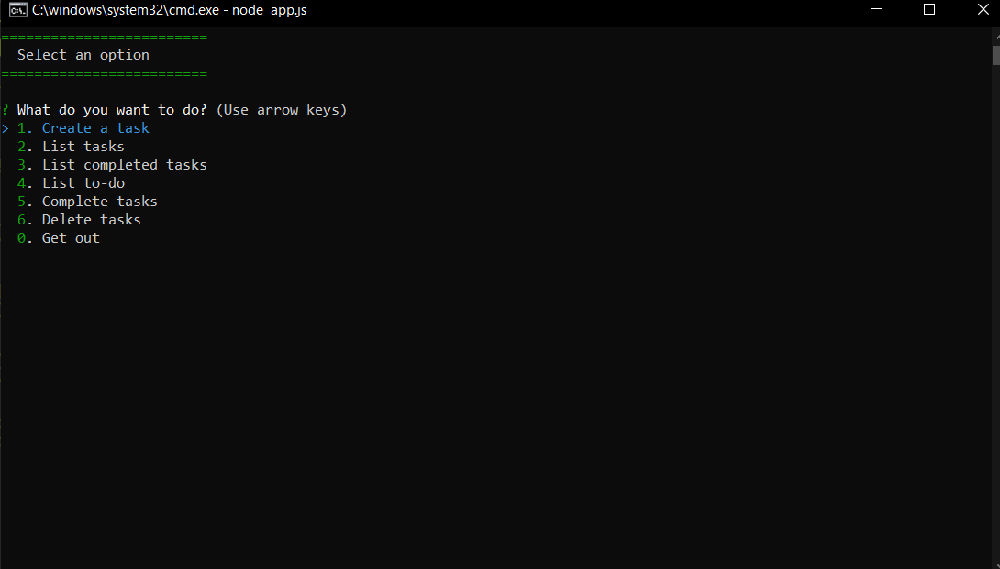
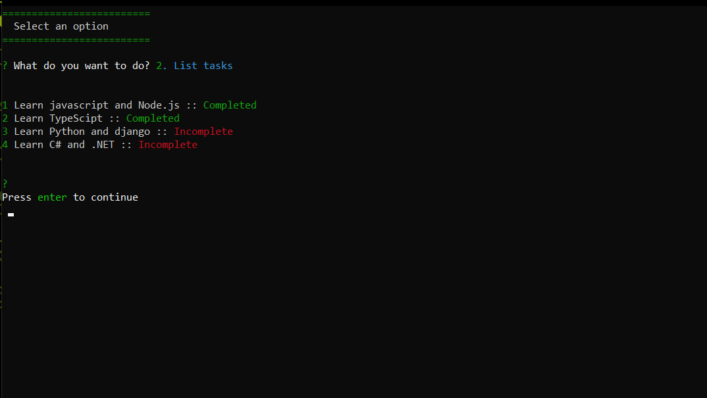
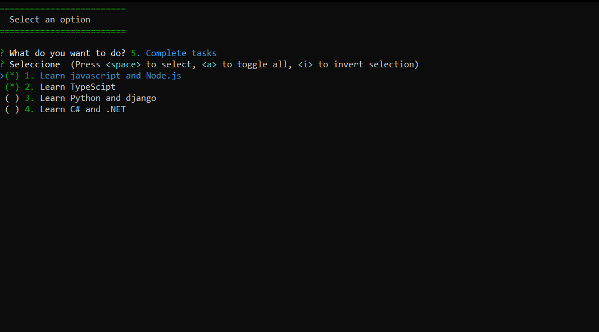
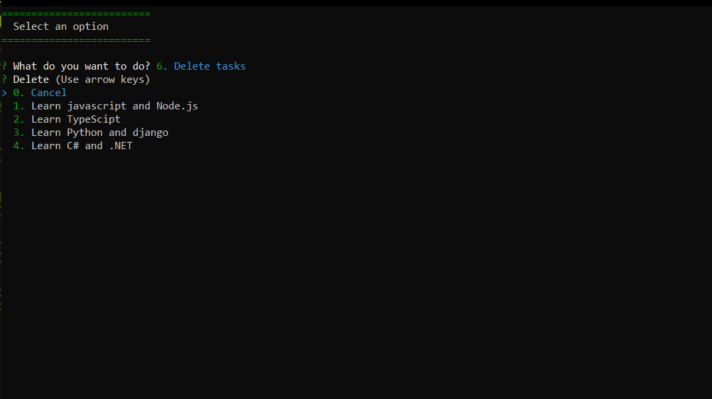
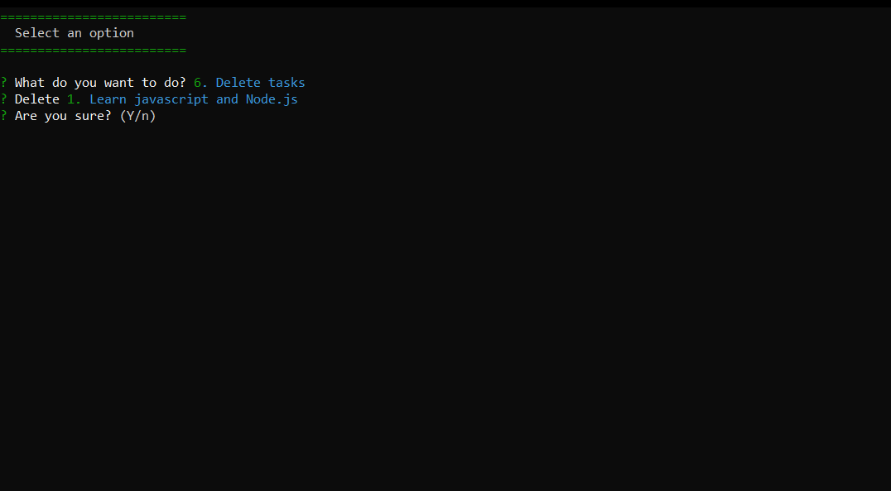

# Interactive console application with Node.js
Interactive console application to list tasks to be done.

## Screenshots
We can choose between different options between listing create or complete a task.

We can see the tasks that are complete and incomplete. 

We can complete a task 

And finally, you can also delete a task.

You will ask us if we are sure to eliminate that task.
